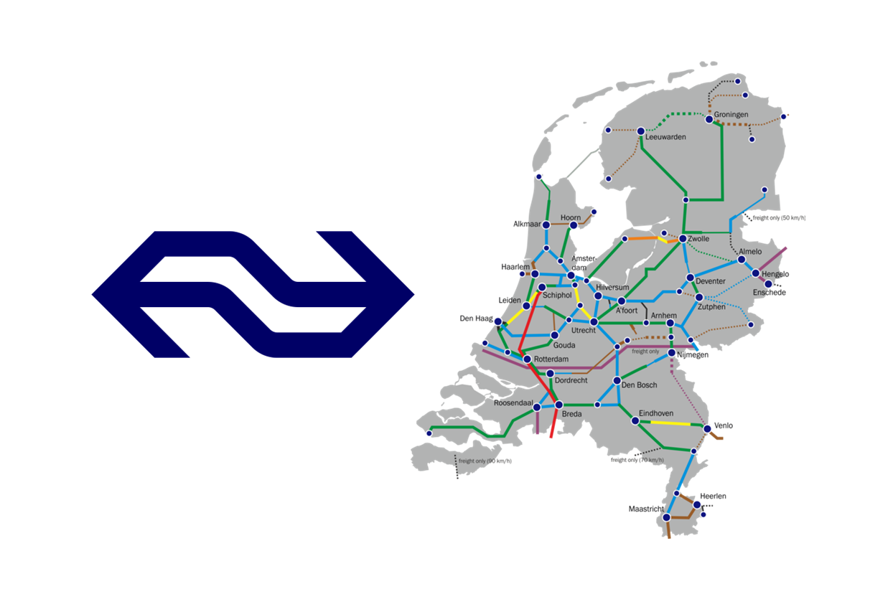

# Dutch Railway Efficiency and Reliability

## Purpose of the Project

The **Dutch Railway Efficiency and Reliability** project aims to design and implement a robust data architecture and automated evaluation system focused exclusively on assessing the **operational performance** of the Dutch railway network.

Its core objective is to develop a **composite index** that quantifies the system’s **efficiency** and **reliability** using a broad set of KPIs:

* Punctuality
* Cancellations
* Disruption impacts
* Frequency
* Capacity utilization
* Operational deviations (station and route level)

By capturing and aggregating these metrics from multiple sources, the project delivers a standardized, objective, and granular measure of operational quality. The index allows analysis by **station**, **train**, **route**, and **region**, supporting bottleneck identification, performance monitoring, and data-driven decisions.

This framework promotes transparency and early detection of risks that could affect service delivery.

---

## Expected Outputs

* **Modular data architecture**: scalable and maintainable ingestion and processing system.
* **Automated batch processing**: daily updates of key operational KPIs.
* **Operational Efficiency & Reliability Index**: normalized, weighted KPI scoring.
* **Multi-dimensional analysis**: filterable by station, route, train, and region.
* **Interactive dashboard**: real-time stakeholder insights.

---

## Conceptual Data Modeling

[![](https://mermaid.ink/img/pako:eNqtVstu2kAU_ZXRrAiCyLwCeEchlaI-giDKonUWE_saRrFn3PGYQCjf0E33Ubtr1v2ifkE_odc2xiQxECm1Nx77nHvPfc14SW3pADVptVq1hC2FyyemJQjRU_DhkinOrj0Ik1eEuFLoMb8Dk9RawXwDM4kCJ5pXbelJZYnElM-F47Mg5SkpdalULg8ibU_JiHHvli3Iqetym4OwF4QJh4zAQ2fc43pRLh8dWcLS6U1SI_G1XJbLT2jDSNg6Yilttcqx8VUaAQ-5cKXymeZAesMz8vf-_ufRY1h8fd4yhBI1kD_fHq4KcAMImNKRAjIAj-3H9pTiM-a9APnU6gX3Y-yvw1b3Ic9FNfmcW9-nIUNn9vfrTXwrwBLscL6d0CJgXMw-EzZ4HhZHijCp54CHKgqS9evq-THyr0ER6ZK1E3BQBg_CXSEVEcZaFhJKWzJfqGKbcVDBWK9T0nNdsDU4hylpbIfwvRkoNoEtNeQ9MCfrokOJQUnwJcLhg6dBxNV8q9KP6WT2WcDsV49l7lzvK17uOkC0VoyLXX15kXzM1BUVt_9mHOv5UaRnw9OSDGUQpb2LEybC9c7B5WGRxeSeAhaSM-HAvCC7655IcnuOUbL_MCRDVBADSX_KBLZFrnDvtpbMNZmFBPlCYLddwpTbHuwsT5rzLM64RFk0Bek_v6zaUx7cMNyzyIBphvK__y4shpK3DjbwDDzcPXQ-Ns93mqHCU0NM0s6UoX554grbIDYHSSBDFoaAuVPJ6h33pA8an553XwmzIEKPi5s8KvKVnI6GWYDJcbcJDlUe8PBwtTEekx_nBunVVKbaNCWt0IniDjW1iqBCfcBQ4yVdxlItmpznFjXxcftMp5ZYITVg4pOUfsZWMppMqekyL8RVFDjYMgPOJorlENz2QfVlJDQ160ZigppLOqdmrdM6NrpGrVE7Mepto9mp0AW-7XaOjYZRrxnNeqNT77Rbqwq9S5wax92m0W01Oi2j3TyptZrtCgWHa6k-pP8wya_M6h-6cb1J?type=png)](https://mermaid.live/edit#pako:eNqtVstu2kAU_ZXRrAiCyLwCeEchlaI-giDKonUWE_saRrFn3PGYQCjf0E33Ubtr1v2ifkE_odc2xiQxECm1Nx77nHvPfc14SW3pADVptVq1hC2FyyemJQjRU_DhkinOrj0Ik1eEuFLoMb8Dk9RawXwDM4kCJ5pXbelJZYnElM-F47Mg5SkpdalULg8ibU_JiHHvli3Iqetym4OwF4QJh4zAQ2fc43pRLh8dWcLS6U1SI_G1XJbLT2jDSNg6Yilttcqx8VUaAQ-5cKXymeZAesMz8vf-_ufRY1h8fd4yhBI1kD_fHq4KcAMImNKRAjIAj-3H9pTiM-a9APnU6gX3Y-yvw1b3Ic9FNfmcW9-nIUNn9vfrTXwrwBLscL6d0CJgXMw-EzZ4HhZHijCp54CHKgqS9evq-THyr0ER6ZK1E3BQBg_CXSEVEcZaFhJKWzJfqGKbcVDBWK9T0nNdsDU4hylpbIfwvRkoNoEtNeQ9MCfrokOJQUnwJcLhg6dBxNV8q9KP6WT2WcDsV49l7lzvK17uOkC0VoyLXX15kXzM1BUVt_9mHOv5UaRnw9OSDGUQpb2LEybC9c7B5WGRxeSeAhaSM-HAvCC7655IcnuOUbL_MCRDVBADSX_KBLZFrnDvtpbMNZmFBPlCYLddwpTbHuwsT5rzLM64RFk0Bek_v6zaUx7cMNyzyIBphvK__y4shpK3DjbwDDzcPXQ-Ns93mqHCU0NM0s6UoX554grbIDYHSSBDFoaAuVPJ6h33pA8an553XwmzIEKPi5s8KvKVnI6GWYDJcbcJDlUe8PBwtTEekx_nBunVVKbaNCWt0IniDjW1iqBCfcBQ4yVdxlItmpznFjXxcftMp5ZYITVg4pOUfsZWMppMqekyL8RVFDjYMgPOJorlENz2QfVlJDQ160ZigppLOqdmrdM6NrpGrVE7Mepto9mp0AW-7XaOjYZRrxnNeqNT77Rbqwq9S5wax92m0W01Oi2j3TyptZrtCgWHa6k-pP8wya_M6h-6cb1J)

---

## Project Scope

### ✅ In Scope

* Train **punctuality** (delays)
* **Cancellations** and **disruptions**
* **Service frequency**
* **Platform changes** and **train density** at stations

Focus: internal operations vs. planned schedules

### 🚫 Out of Scope

* Pricing and costs
* Demand or population analysis
* Crowd levels (onboard or at stations)
* Customer satisfaction or experience
* Non-operational KPIs

---

## Datasets

### Journey Details – Reisinformatie API

Trip-level tracking of operational execution:

* Planned vs. actual times & platforms
* Cancellations & stop-level fulfillment
* Train composition and routing
* Crowd forecasts

✅ Core dataset for punctuality, delay, and execution metrics.

### Stations – NS Stations API

Station metadata and context enrichment:

* Identifiers, type, coordinates
* Accessibility and layout

✅ Enables segmentation and context-aware KPIs.

### Get Vehicle – Virtual Train API

Real-time registry of active trains:

* Train ID (`ritId`) and metadata

🔁 Enables dynamic queries to Journey Details API.

### Disruptions – Disruptions API

Structured event data on service disruptions:

* Location, cause, severity, duration
* Affected stations and trains

✅ Measures resilience and service reliability.

---

## Tools

### S3

* Raw and cleansed data storage, organized by date/type.

### Iceberg

* Versioned and partitioned table format for raw and production layers.
* Enables *time travel* and safe publishing with fast-forwarding.

### Airflow

* Orchestrates ingestion from APIs and triggers transformations.
* DAGs manage dependencies, retries, and scheduling.

### dbt

* Transforms raw data into dimensional models in Snowflake.
* Adds version control, testing, and lineage tracking.

### Snowflake

* Cleaned and production-ready data warehouse.
* Optimized for dashboarding and BI.

### PyIceberg

* Programmatic Iceberg schema and table management.
* Integrated with Airflow for modular pipelines.

### Spark

* Fast-forwarding from audit branches to production in Iceberg.
* Ensures validated and clean data transitions.

---
