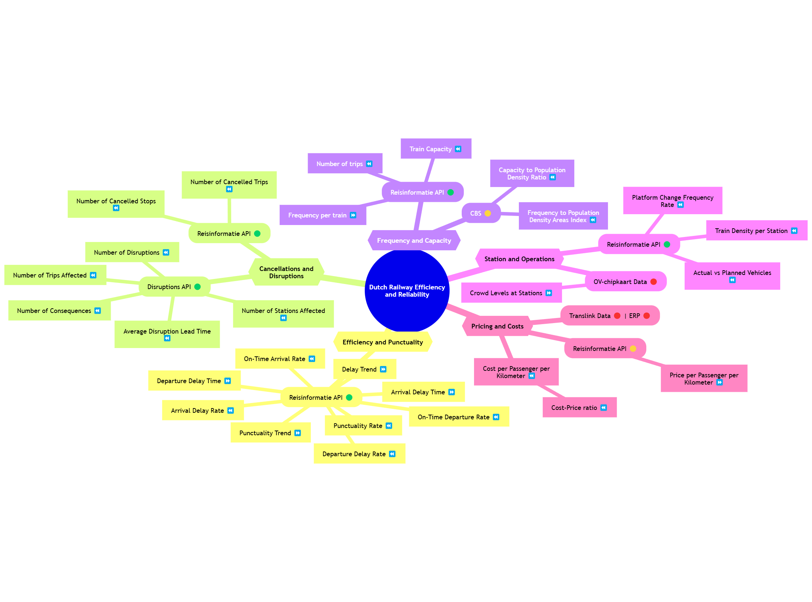

# Dutch Railway Efficiency and Reliability

 

  

 

## Purpose of the Project

The **Dutch Railway Efficiency and Reliability** project aims to design and implement a robust data architecture and automated evaluation system focused exclusively on assessing the **operational performance** of the Dutch railway network.

Its core objective is to develop a **composite index** that quantifies the system’s **efficiency** and **reliability** using a broad set of KPIs:

* Punctuality
* Cancellations
* Disruption impacts
* Frequency
* Capacity utilization
* Operational deviations (station and route level)

By capturing and aggregating these metrics from multiple sources, the project delivers a standardized, objective, and granular measure of operational quality. The index allows analysis by **station**, **train**, **route**, and **region**, supporting bottleneck identification, performance monitoring, and data-driven decisions.

This framework promotes transparency and early detection of risks that could affect service delivery.

---

## Expected Outputs

* **Modular data architecture**: scalable and maintainable ingestion and processing system.
* **Automated batch processing**: daily updates of key operational KPIs.
* **Operational Efficiency & Reliability Index**: normalized, weighted KPI scoring.
* **Multi-dimensional analysis**: filterable by station, route, train, and region.
* **Interactive dashboard**: real-time stakeholder insights.

---

## Conceptual Data Modeling

---

## Project Scope

### ✅ In Scope

* Train **punctuality** (delays)
* **Cancellations** and **disruptions**
* **Service frequency**
* **Platform changes** and **train density** at stations

Focus: internal operations vs. planned schedules

### 🚫 Out of Scope

* Pricing and costs
* Demand or population analysis
* Crowd levels (onboard or at stations)
* Customer satisfaction or experience
* Non-operational KPIs

---

## Datasets

### Journey Details – Reisinformatie API

Trip-level tracking of operational execution:

* Planned vs. actual times & platforms
* Cancellations & stop-level fulfillment
* Train composition and routing
* Crowd forecasts

✅ Core dataset for punctuality, delay, and execution metrics.

### Stations – NS Stations API

Station metadata and context enrichment:

* Identifiers, type, coordinates
* Accessibility and layout

✅ Enables segmentation and context-aware KPIs.

### Get Vehicle – Virtual Train API

Real-time registry of active trains:

* Train ID (`ritId`) and metadata

🔁 Enables dynamic queries to Journey Details API.

### Disruptions – Disruptions API

Structured event data on service disruptions:

* Location, cause, severity, duration
* Affected stations and trains

✅ Measures resilience and service reliability.

---

## Tools

| **Tool**     | **Usage in the Project**                                                                                                                  |
|--------------|-------------------------------------------------------------------------------------------------------------------------------------------|
| **S3**       | Stores raw and cleansed data from NS APIs, structured by date and data type. Serves as the staging layer before processing.              |
| **Iceberg**  | Manages partitioned and versioned tables in both raw and production layers. Supports time travel and safe publishing using fast-forwarding. |
| **Airflow**  | Coordinates the data pipeline: fetches data from APIs, stores it in S3, and triggers transformations. Manages retries and dependencies.   |
| **dbt**      | Cleans and transforms raw data into dimensional models in Snowflake. Adds testing, documentation, and lineage.                            |
| **Snowflake**| Hosts the cleansed and production-ready data. Provides scalable, performant storage for analytics and dashboarding.                       |
| **PyIceberg**| Defines Iceberg schemas and tables programmatically. Integrated into Airflow for automation and modular schema/table management.           |
| **Spark**    | Handles fast-forwarding of data from Iceberg audit branches to production. Publishes only validated data to the final layer.              |
