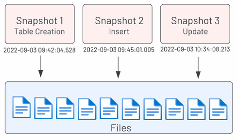
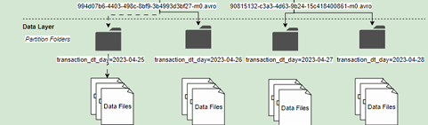

# 🧊 Apache Iceberg - Day 1

> This lecture provides a conceptual overview of Apache Iceberg's architecture and key features such as snapshots, time travel, and partitioning. It explains why these concepts are critical for handling large-scale data efficiently and includes real-world examples from companies like Netflix and Facebook.

## 📊 Iceberg Architecture

---

### 🔂 Snapshots



- Snapshots are like Git commits: each one represents a stack of changes (e.g., `INSERT`, `UPDATE`, `CREATE TABLE`, `ALTER TABLE`).
- Every schema or data mutation generates a new snapshot.
- Snapshots enable querying data as it was at a specific moment in time—even after deletions.

```sql
SELECT * 
FROM table$snapshots;
```

---

### ⏱️ Time Travel

- Time travel lets you query data from a specific snapshot or timestamp.
- Iceberg selects the most recent snapshot available before or at the specified time.

```sql
SELECT * 
FROM table 
FOR TIMESTAMP AS OF TIMESTAMP '2022-09-03 09:45:01.005Z';
```

---

### 🧱 Partitioning



- Almost every table should be partitioned.

#### 💡 Why?
- Example: At Netflix, a pipeline processed **2 petabytes/day** → **730 petabytes/year**. Querying that without partitioning would be impractical.

#### ❌ Exceptions
- Small, slowly-changing dimension tables (e.g., `dim_country` at Facebook) do not require partitioning.

#### 📆 Best Practices
- Partition on **timestamp/date** (applies to 95%+ of cases).
- Use **low-cardinality dimensions** to maximize partition pruning.
- **Dimensions tables** → use snapshot date or API extract date.
- **Fact tables** → use event timestamp.

#### 🧹 Real-world Case
- Facebook sends ~**50B notifications/day**, where **47B are push** and others are SMS/email. Analysts querying only SMS should not scan all 50B records.
  - Solution: Partition by channel.

```sql
CREATE TABLE orders_iceberg (
  order_id BIGINT,
  order_name VARCHAR,
  transaction_dt TIMESTAMP
) 
WITH (
  partitioning = ARRAY['day(transaction_dt)']
);
```

#### 🌟 Iceberg's Hidden Partitioning
- Iceberg allows **logical partitioning** without exposing the partition column.
- You **don’t need to reference** partition columns in queries.
- Partition pruning still works behind the scenes.
- This feature is **not available in Hive or Delta Lake**.
