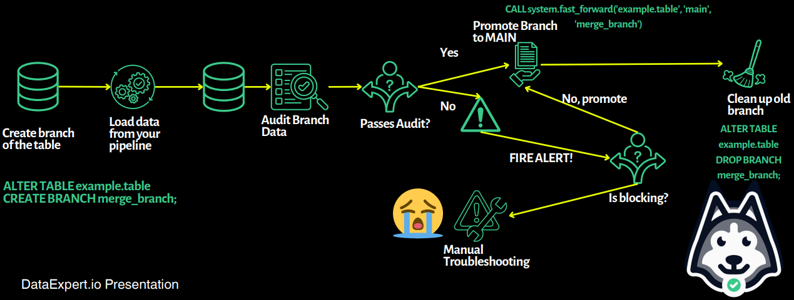
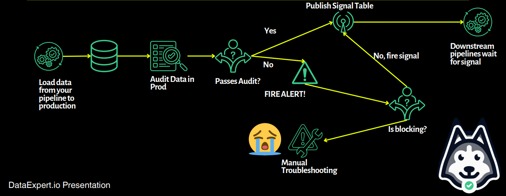

# 🧊 Apache Iceberg — Lecture Day 3

> This lecture dives into data contracts as a foundation for reliable pipelines, the WAP vs Signal Table patterns for production data, and the limits of Iceberg time travel.
> It emphasizes the importance of aligning technical and business expectations to build sustainable data systems.

---

## 🤝 Data Contract

> A **data contract** is an agreement between data producers and consumers. It defines what data is generated, how it is produced, and how it will be used.

### 📐 Types of Expectations

- **Technical**: How and what data is generated.
- **Business**: Why and how data is consumed.

### 📊 Contract Maturity Levels

| Level         | Note                                                     | Requirements                                                                                                                                          |
|---------------|----------------------------------------------------------|--------------------------------------------------------------------------------------------------------------------------------------------------------|
| **Basics**     | Almost everybody does this (explicitly or implicitly).   | - Data schema<br>- Table names<br>- Data stores                                                                                                       |
| **Intermediate** | Still the bare minimum in some regards.                 | - How does data show in production?<br>- When should the data be expected?<br>- How long is it retained?<br>- When is it anonymized?                 |
| **Advanced**   | Stakeholders formally agree to expectations.             | - What is the ROI generated by this data?<br>- What decisions are made from this data?<br>- What surfaces are exposing this data?                    |

📌 **Note**: Don’t build pipelines for one-time use. Build assets that continue to provide value and reduce technical debt over time.

---

## 🏭 Production Data Patterns

### ♻️ WAP Pattern (Write → Audit → Publish)

> A safer approach used by Airbnb, Netflix, Google, and Apple.

- No separate **DEV**, **STAGING**, **PROD** tables.
- Instead:
  1. Write to an **identical schema** in a separate branch.
  2. Run **audits** on that data.
  3. If successful, **promote** the data to production (main branch).
- ✅ Prevents bad data from ever showing up in production.
- ✅ More intuitive and sustainable.



---

### 🪧 Signal Table Pattern

> Used at Meta. Trades safety for speed.

- Steps:
  1. Write directly to production table.
  2. Audit the table.
  3. Downstream pipelines wait for a **signal** before reading new data.
- ⚠️ Faster than WAP, but dangerous if pipelines don’t respect the signal logic.
- ❌ More prone to data propagation errors.



---

## ⏳ Limits to Time Travel

> Iceberg supports snapshot-based time travel, but it’s not free.

### 🧨 Why You Should Expire Snapshots

- ❌ Holding onto all snapshots is expensive.
- 🛑 GDPR: Individuals have the **right to be forgotten**.
- ✅ Keep only the **last 3–4 snapshots**, or whatever is needed.

### 🧼 How to Expire Snapshots in Iceberg

```sql
CALL system.expire_snapshots(
    table => 'bootcamp.nba_player_season', 
    older_than => TIMESTAMP'2025-01-01 00:00:00',
    retain_last => 1
)
