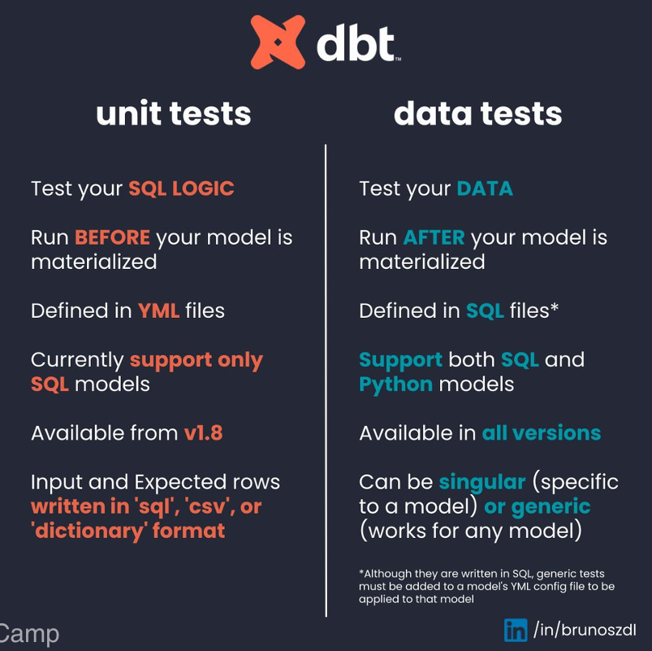
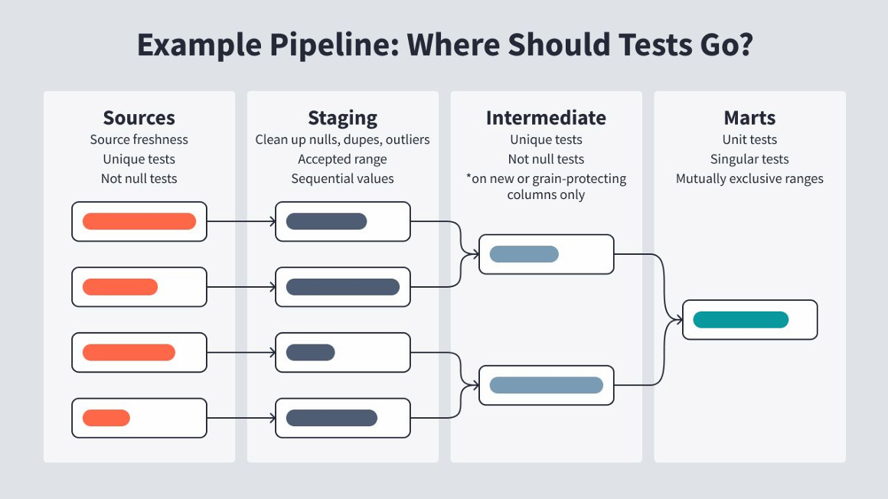
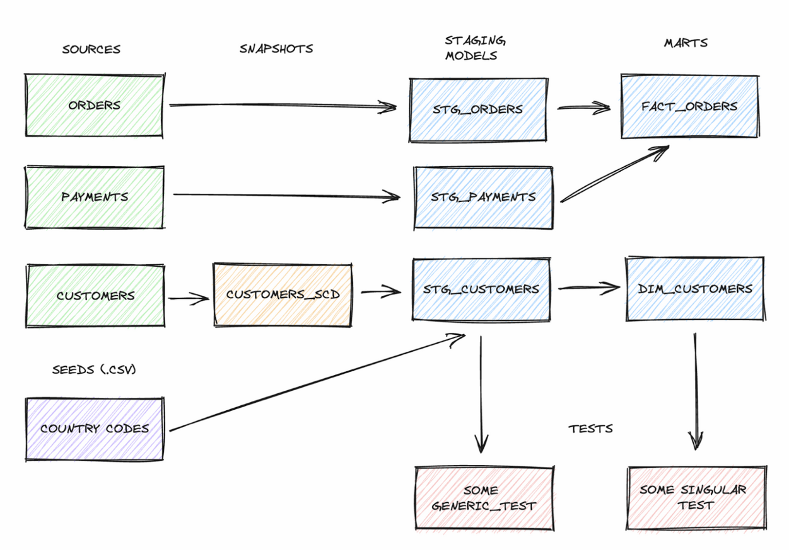

# 📦 dbt Basics - Day 2

> In this class we covered different types of tests (data and unit tests) in dbt, how to write them, when to use them, and how to implement Snapshots as Slowly Changing Dimensions Type 2 (SCD2).

---

## ✅ Tests

### Data Tests

- Validate the quality of data inside a table (run **after** the model is created).
- Confirm that the data meets certain expectations or business rules.
- Types:
  - **Generic**: reusable, written with Jinja.
  ```sql
  
  
      select *
      from {{ model }}
      where {{ column_name }} is null
  
  
  ```

  - **Singular**: specific to a single model.
  ```sql
  -- Refunds have a negative amount, so the total amount should always be >= 0.
  -- Therefore, return records where this isn't true to make the test fail
  select
      order_id,
      sum(amount) as total_amount
  from {{ ref('fct_payments') }}
  group by 1
  having not(total_amount >= 0)
  ```

- dbt comes with four built-in generic tests:
  - `not_null`
  - `unique`
  - `accepted_values`
  - `relationships`

- Many more are available through packages like `dbt_utils` and `dbt_expectations`.
- You can adjust test severity (`warn` or `error`) and log failed records to your database for debugging.

### Unit Tests

- Test your **SQL logic**, not real production data.
- Define inputs and expected outputs, similar to testing Python functions.
- Run **before** the model is created.
- Great for development and CI/CD pipelines.

- Supports inputs as:
  - Dictionaries
  - CSVs
  - SQL (via `SELECT ... UNION ALL`)
 
```yaml
unit_tests:
  - name: test_is_valid_email_address
    description: "Check my is_valid_email_address logic captures all known edge cases - emails with valid and invalid domains"
    model: dim_customers
    given:
      - input: ref('stg_customers')
        rows:
          - {email: cool@example.com, email_top_level_domain: example.com}
          - {email: cool@unknown.com, email_top_level_domain: unknown.com}
          - {email: badgmail.com, email_top_level_domain: gmail.com}
          - {email: missingdot@gmailcom, email_top_level_domain: gmail.com}
      - input: ref('top_level_email_domains')
        rows:
          - {tld: example.com}
          - {tld: gmail.com}
    expect:
      rows:
        - {email: cool@example.com, is_valid_email_address: true}
        - {email: cool@unknown.com, is_valid_email_address: false}
        - {email: badgmail.com, is_valid_email_address: false}
        - {email: missingdot@gmailcom, is_valid_email_address: false}
```



---

## 🏆 dbt Test Best Practices

### Data Tests

| Type     | Typical Use Cases                                 |
|----------|---------------------------------------------------|
| Generic  | `unique`, `not_null`, `accepted_values`, sets and ranges, table shape (row count)   |
| Singular | Business-specific logic                           |

### Unit Tests
                   
- Complex joins or filters         
- Regex functions                   
- Incremental models                
- Window functions                 
- Business logic validation

  

---

## 🕒 Snapshots

> Snapshots in dbt are the built-in way to implement Slowly Changing Dimension Type 2 (SCD2), allowing you to track changes in records over time.

### Key Concepts:

- Used on top of **sources**.
- Require a `unique_key` to track records.
- Store historical versions when data changes.
- Run using `dbt snapshot`.

### Snapshot Strategies

#### 🕒 Timestamp

- Requires an `updated_at` column.
- Tracks changes by comparing timestamps.
```yaml
snapshots:
  - name: orders_snapshot
    relation: source('jaffle_shop', 'orders')
    config:
      schema: snapshots
      database: analytics
      unique_key: id
      strategy: timestamp
      updated_at: updated_at
```

#### ✅ Check

- Compares specified columns (`check_cols`) to detect changes.
```yaml
snapshots:
  - name: orders_snapshot_check
    relation: source('jaffle_shop', 'orders')
    config:
      schema: snapshots
      unique_key: id
      strategy: check
      check_cols:
        - status
        - is_cancelled
```



---

## 💡 Snapshot Best Practices

- Use `source()` for better lineage tracking.
- Include as many columns as possible (you can’t add them later).
- Avoid joins (they make `updated_at` less reliable).
- Limit transformations in your query.

> **KEEP YOUR SNAPSHOTS AS SIMILAR AS POSSIBLE TO THE SOURCE!**

---

## 📦 dbt Packages

- Extensions that add models, macros, or tests to your project.

### Useful Packages:

| Package                | Functionality                              |
|------------------------|--------------------------------------------|
| `codegen`              | Auto-generates boilerplate code            |
| `dbt_utils`            | Adds macros and reusable tests             |
| `dbt_expectations`     | Great Expectations-inspired test suite     |
| `dbt_project_evaluator`| Enforces project best practices            |

> Find more at: [dbt Hub](https://hub.getdbt.com/)
